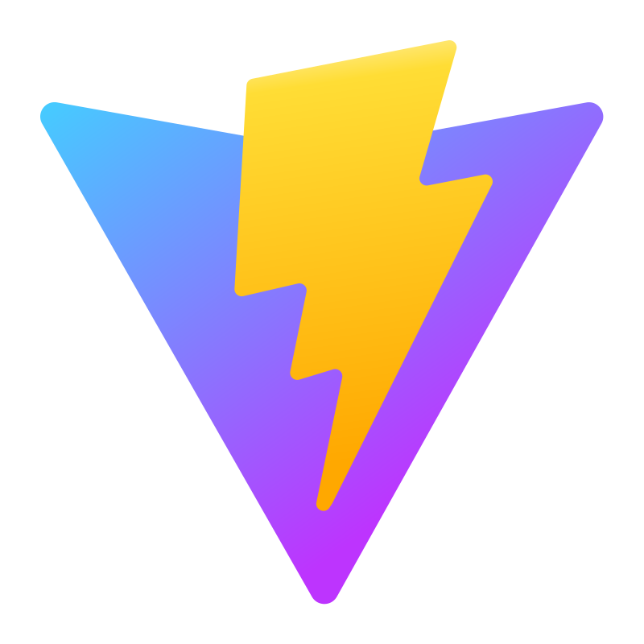
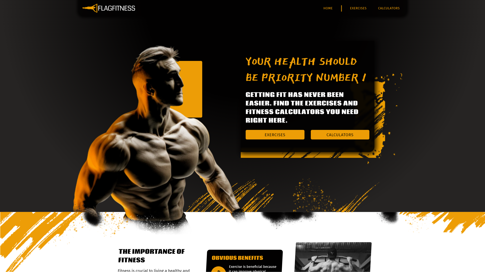

# 🎲 Zacharie McGee

**` Dude Who Codes `**

🚧 As with most things in life, this is a work in progress! 🔨

I'm a self-taught web developer who's contributing to our digital landscape one line of hopefully-not-so-buggy code at a time. All projects thus far have been built from the beginning stages of ideation and design iteration through to content finalization and deployment. Slowly but surely transforming this meandering hobby into a steadfast career.

***

- 🔭 I’m currently working on FlagFitness, a mock fitness website.
- 🌱 I’m currently learning everything I don't know that I need to know (which is everything it seems).
- ⚡ Fun fact: I've dipped into 3D modeling and game dev at some point.
- 🔨 Looking for work!

 

### ⚒️ Languages and Tools

<!--  -->

 
 

### 🔬 Recent Projects

| | |
|:-------------------------:|:-------------------------:|
|<a href='https://zachariemcgee.github.io/flagfitness/' target='_blank'>|<a href='https://zachariemcgee.github.io/obligavid_yt-clone/' target='_blank'>|
| | |

<!--
**ZacharieMcGee/ZacharieMcGee** is a ✨ _special_ ✨ repository because its `README.md` (this file) appears on your GitHub profile.

